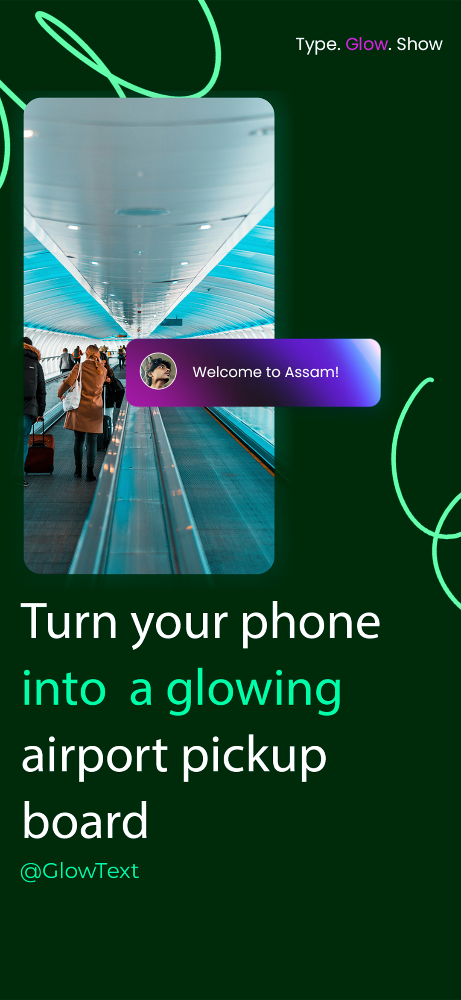
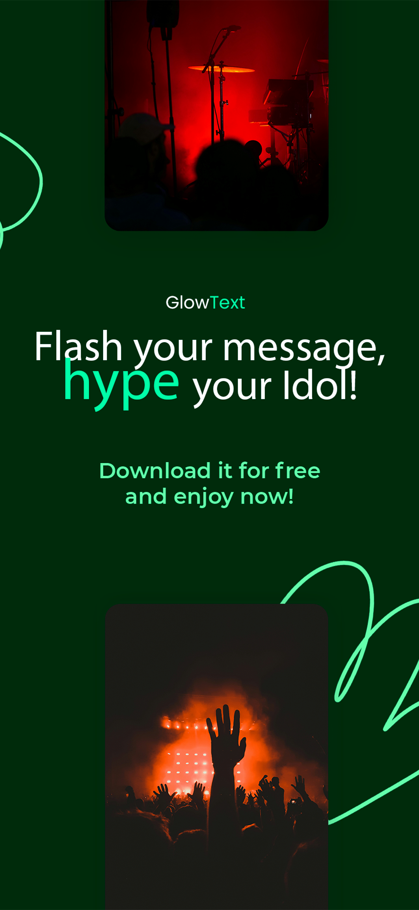
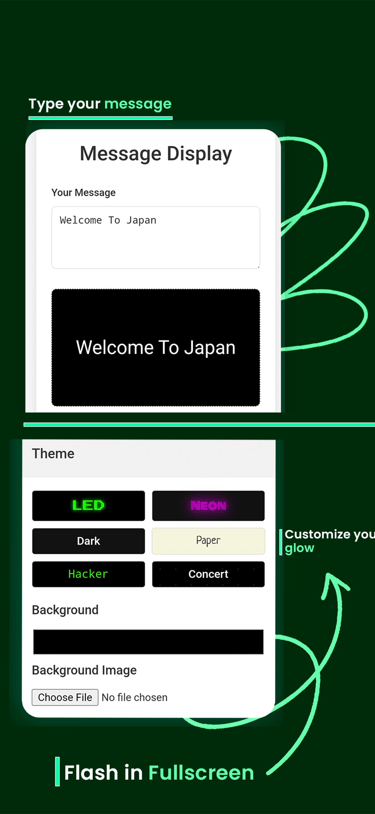
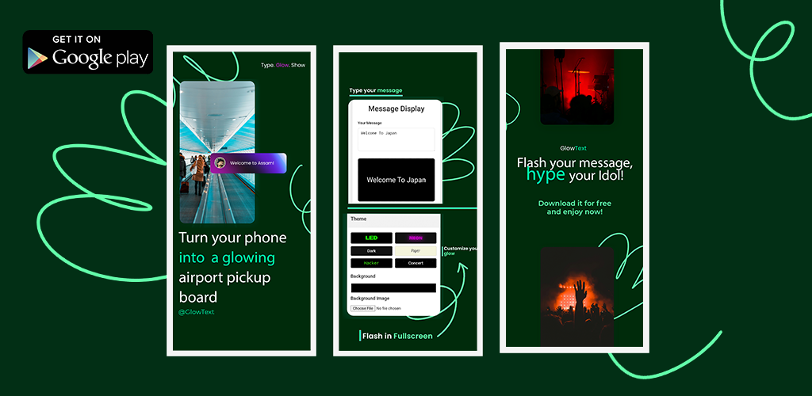
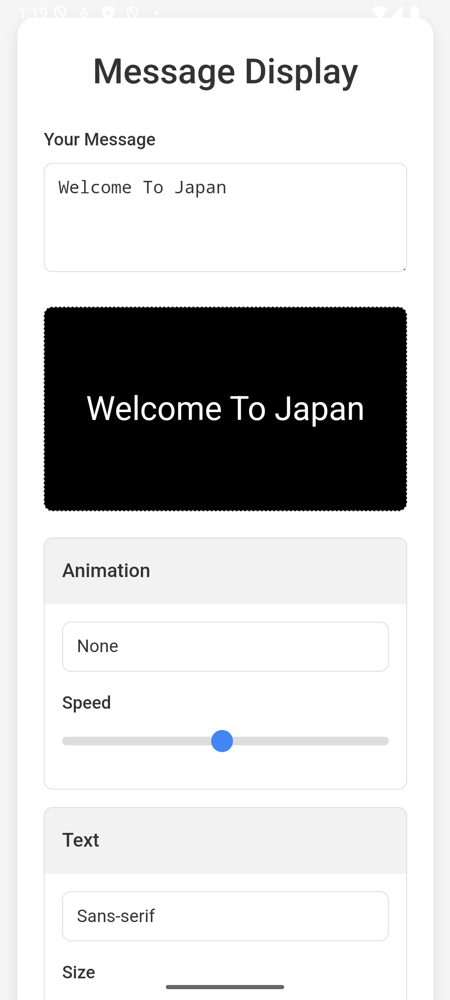
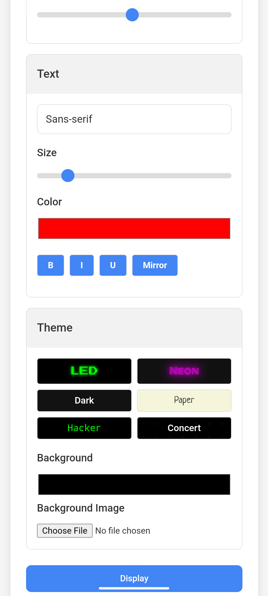

# 🌟 Glow Text by ZIPPTECH

**Glow Text** is a simple yet powerful web app that lets you turn any message into a glowing, animated display on your screen. Whether you're at a concert, party, airport, rally, or just want to grab someone's attention, Glow Text helps you shine bright—literally.

> ✨ “Say it loud. Say it glowing.” — ZIPPTECH

---

## 🎯 Features

- 📝 **Custom Text**: Type any message you want to display.
- 🌈 **Themes & Colors**: Choose from multiple glow themes and vibrant color options.
- 💃 **Animations**: Make your message dance with built-in animation styles.
- 🛠️ **Customization**: Adjust font size, speed, background, and more.
- 🎉 **Use Cases**:
  - Flash messages at concerts or festivals.
  - Call someone at the airport in a crowd.
  - Light up your party or event.
  - Use it as a digital protest board or signal board.

---

## 💻 Tech Stack

| Tech        | Purpose              |
|-------------|----------------------|
| HTML5       | Structure             |
| CSS3        | Styling & animations |
| JavaScript  | Interactivity        |

No frameworks. No backend. Just clean and responsive web magic.

---

## 🚀 How to Use

1. Open the app in your browser.
2. Type your message.
3. Select a theme, animation, and style.
4. Hit **Display** and turn your screen toward the crowd.
5. Let it glow!

---

---
## 📸 Screenshots

### 🔹 Glowing Text Preview 1

  

### 🔹 Glowing Text Preview 2

  

### 🔹 Glowing Text Preview 3

  

### 🔹 Features Section

  

### 🔹 App Home

  

### 🔹 Home with Theme

  

